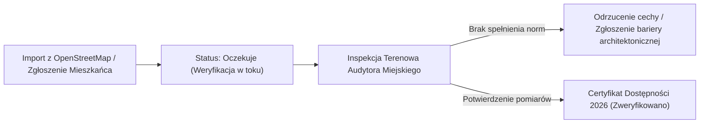

# Specyfikacja Techniczna, Standardy Dostępności i Zgodność Prawna
## MapaBezBarier Kraków · Oficjalny Standard Projektu HackYeah 2026

---

## 1. Cel i Zakres Dokumentu

Niniejszy dokument stanowi oficjalną specyfikację techniczną, normatywną oraz prawną platformy **MapaBezBarier Kraków**. Określa:
1. Główne obszary i cechy dostępności architektonicznej oraz sensorycznej obiektów.
2. Formalny model danych i mapowanie atrybutów OpenStreetMap.
3. Specyfikację publicznych interfejsów API platformy.
4. Metodykę dwustopniowej weryfikacji miejskiej.
5. Analizę zgodności z licencją Open Database License (ODbL 1.0) oraz zasadami ochrony prywatności.

Dokument jest przeznaczony dla audytorów dostępności, programistów rozwijających integracje miejskie oraz zespołów ds. dostępności cyfrowej jednostek samorządu terytorialnego.

---

## 2. Główne Obszary Oceny Dostępności

Platforma kategoryzuje i weryfikuje cechy obiektów w oparciu o cztery kluczowe obszary potrzeb:

### 2.1. Dostępność wejścia i strefy wejściowej
- **Wejście bezprogowe:** Wejście bezpośrednio z poziomu chodnika lub za pośrednictwem rampy podjazdowej, umożliwiające swobodny wjazd wózkiem inwalidzkim lub dziecięcym.
- **Szerokie drzwi wejściowe:** Odpowiedni prześwit skrzydeł drzwiowych oraz brak ciężkich samozamykaczy utrudniających samodzielne wejście.

### 2.2. Komunikacja wewnątrz obiektu
- **Winda przystosowana:** Dostępność kondygnacji użytkowych za pomocą windy z automatycznymi drzwiami, oznaczeniami fakturowymi i komunikatami głosowymi.
- **Ciągi komunikacyjne:** Korytarze i przejścia o szerokości umożliwiającej swobodne mijanie się i manewrowanie wózkiem inwalidzkim.

### 2.3. Węzły sanitarne (Toaleta Dostępna)
- **Przystosowanie dla osób z niepełnosprawnością:** Obecność poręczy asekuracyjnych, przestrzeń manewrowa dla wózka oraz system wzywania pomocy (alarm SOS).

### 2.4. Udogodnienia sensoryczne i komunikacyjne
- **Pętla indukcyjna:** System wspomagania słuchu w punktach obsługi lub na salach widowiskowych dla osób korzystających z aparatów słuchowych.
- **Tłumacz PJM:** Możliwość skorzystania z obsługi w Polskim Języku Migowym na miejscu lub w formie wideopołączenia z tłumaczem online.
- **Pies asystujący:** Prawo swobodnego wstępu dla osób korzystających z pomocy psa przewodnika lub psa asystującego.
- **Strefa wyciszenia / Ciche godziny:** Dostępność przestrzeni wyciszenia lub wyznaczonych godzin o obniżonym poziomie bodźców dźwiękowych i świetlnych.

---

## 3. Model Danych i Mapowanie Atrybutów OSM

Aplikacja przetwarza dane w zunifikowanym formacie JSON zgodnym ze standardem TypeScript (`Place`). Poniższa tabela przedstawia transformację surowych tagów bazy OpenStreetMap na cechy weryfikowane w platformie:

| Cecha w platformie | Tagi wejściowe OpenStreetMap | Wartości kwalifikujące | Zakres weryfikacji miejskiej |
|---|---|---|---|
| **Wejście bezprogowe** | `wheelchair`, `entrance:step` | `wheelchair=yes`, `step=0` | Weryfikacja braku progu lub obecności rampy |
| **Winda przystosowana** | `elevator`, `wheelchair` | `elevator=yes` | Potwierdzenie obecności windy i oznaczeń |
| **Toaleta dostępna** | `toilets:wheelchair` | `yes` | Potwierdzenie przystosowania kabiny i uchwytów |
| **Pętla indukcyjna** | `hearing_loop`, `induction_loop` | `yes` | Potwierdzenie sprawności systemu pętli |
| **Pies asystujący** | `guide_dogs`, `assistance_animals` | `yes`, `permitted` | Weryfikacja braku zakazu wstępu z psem |
| **Polski Język Migowy** | `speech:pl-pjm`, `sign_language:pjm` | `yes` | Dostępność personelu lub tabletu z usługą PJM |
| **Dla słabowidzących** | `blind:description`, `tactile_paving` | `yes`, ciągi fakturowe | Kontrastowe oznaczenia krawędzi i ciągi dotykowe |

---

## 4. Specyfikacja Publicznych Interfejsów API

Aplikacja udostępnia interfejsy REST API w ramach architektury Next.js App Router:

### 4.1. `GET /api/places`
Zwraca listę obiektów POI w granicach administracyjnych Krakowa wraz z atrybutami dostępności.
- **Parametry:** brak (automatyczne pobieranie na podstawie krakowskiego Bounding Box).
- **Zasada działania:**
  - Zapytanie sprawdza procesową pamięć podręczną serwera (Cache TTL: 12h).
  - W przypadku braku wpisu w cache, serwer wysyła zapytanie Overpass QL do instancji `overpass-api.de`.
  - W przypadku limitu zapytań (HTTP 429) lub przekroczenia czasu oczekiwania (10 s) następuje bezbłędne przełączenie na referencyjny zbiór `BASELINE_KRAKOW_PLACES`.
- **Kody odpowiedzi:**
  - `200 OK` – Zwrócono tablicę obiektów `Place[]`.

### 4.2. `GET /api/geocode?q={adres}`
Zwraca współrzędne geograficzne punktu na podstawie wpisanego adresu w Krakowie.
- **Parametry:** `q` (ciąg znaków, np. `Floriańska 12, Kraków`).
- **Integracja:** Serwery Nominatim OpenStreetMap z nagłówkiem `User-Agent` i parametrem `countrycodes=pl`.
- **Kody odpowiedzi:**
  - `200 OK` – Obiekt współrzędnych `{ lat: number, lon: number, displayName: string }`.
  - `400 Bad Request` – Brak parametru `q`.

### 4.3. `ALL /api/auth/[...all]`
Endpoint obsługujący sesje użytkowników, rejestrację, logowanie oraz mechanizmy kontroli uprawnień (RBAC) w oparciu o silnik Better-Auth i SQLite.

---

## 5. Metodyka Dwustopniowej Weryfikacji Miejskiej

1. **Etap 1: Wstępna rejestracja danych:**
   Wszystkie rekordy zaciągnięte ze źródeł społecznościowych lub zgłoszone przez właścicieli obiektów otrzymują status `verificationStatus: "oczekuje"`. Nie są one traktowane jako oficjalnie potwierdzone.
2. **Etap 2: Audyt terenowy i zatwierdzenie:**
   Audytor Urzędu Miasta weryfikuje fizyczne parametry lokalu za pomocą narzędzi pomiarowych. Po zatwierdzeniu w panelu administracyjnym obiekt otrzymuje status `verificationStatus: "zweryfikowano"` oraz oficjalną pieczęć Certyfikatu Dostępności.

---

## 6. Analiza Zgodności Prawnej i Prywatności (ODbL & RODO)

### 6.1. Zgodność z licencją Open Database License (ODbL 1.0)
- **Prawa autorskie bazy danych:** Dane obiektów OpenStreetMap podlegają licencji ODbL. Aplikacja prezentuje wymaganą notę atrybucyjną *"© OpenStreetMap contributors"* w bezpośrednim sąsiedztwie widoku mapy.
- **Oddzielenie bazy od kodu:** Kod źródłowy aplikacji (interfejs użytkownika, algorytmy wyszukiwania, logika biznesowa) jest dystrybuowany na licencji MIT, co jest w pełni dozwolone w ramach tzw. *Produced Works* na gruncie ODbL sekcja 4.3.

### 6.2. Ochrona prywatności i RODO (Privacy-by-Design)
- **Brak trackerów:** Serwis nie korzysta z cookies analitycznych, pikseli marketingowych ani zewnętrznych skryptów profilujących ruch.
- **Anonimizacja zgłoszeń barier:** Raporty o barierach architektonicznych nie wymagają podawania danych wrażliwych ani numerów PESEL.
- **Kryptografia haseł:** Hasła kont lokalnych są hashowane algorytmem kryptograficznym przed zapisem do bazy SQLite.
